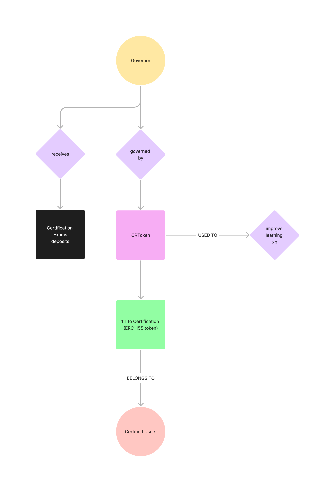
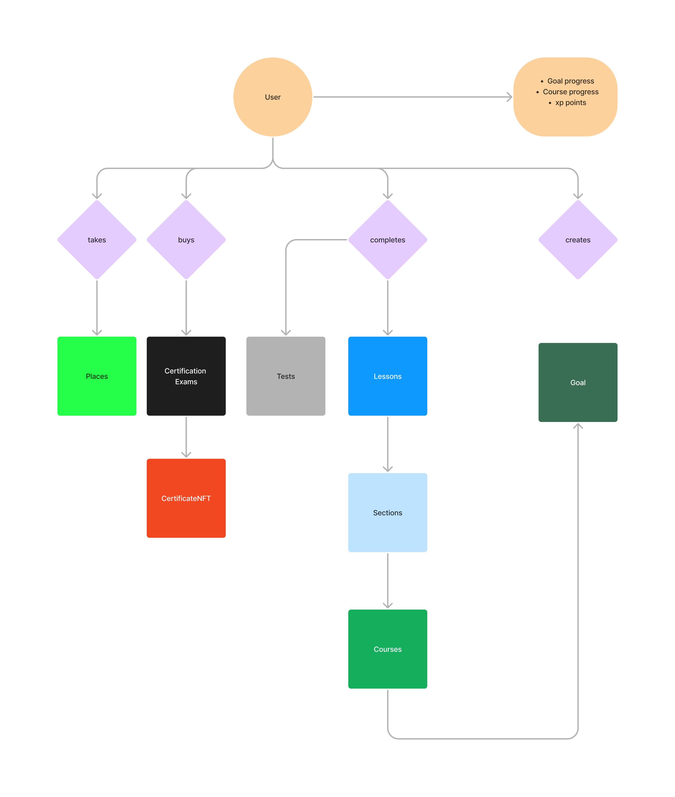

## Certificate Generator and DAO v0.2

This is a project that simulates a real world certificate generation Institution.
The students can add courses to their own Student Path.
The certificate is granted for the student when a certain number of courses are completed 
(aka all lessons are finished). The certificate is minted and tranferred in the form of ERC1155.

## Contracts
# CourseFactory
The CourseFactory contract permits to create courses that have a verified true random id
# StudentPath
Each student can have its own path, where all courses and lessons data are stored.
# CertificateNFT

1. 
2. Each student has his own Path
3. Controls funds received by CourseFactory students
4. Can execute a tx only if it's been voted on
5. **CRTokens** can be purchased only if a Certificate has been earned
6. The ratio between CRTokens (ERC20) minted and Certificates earned (ERC1155) must always be 1:1

## Flow

## Tools
- Openzeppeli   n: ERC1967Proxy, AccessControl
- Chainlink: VRF