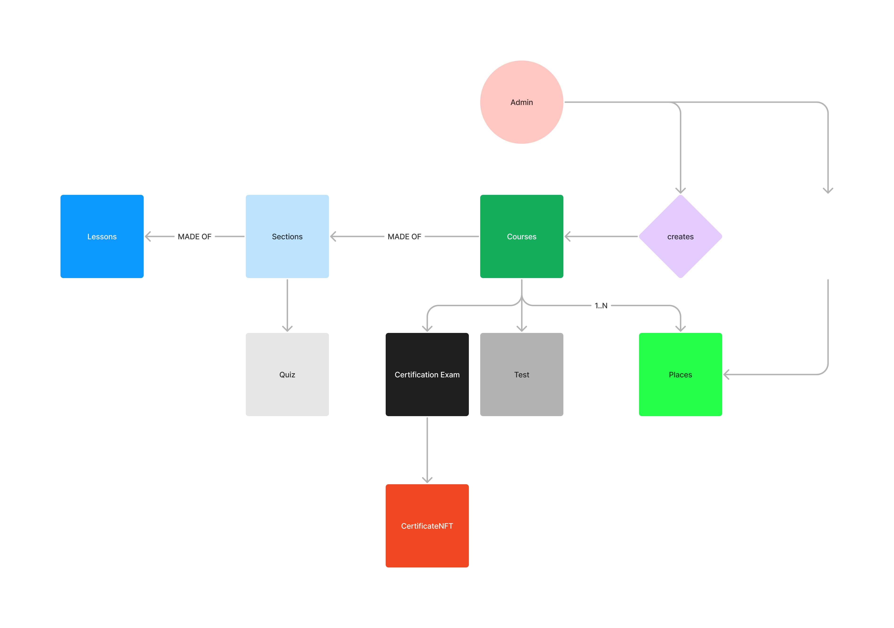

## Certificate Generator and DAO v0.2

This is a project that simulates a real world Certificate Generation Institution.
Each student can add 1 or more courses to their own Student Path.
A Certificate is granted for the student only when a certain number of courses are completed 
and all lessons are finished. The Certificate is minted and transferred in the form of ERC1155.

A DAO where their members must have at least 1 certificate is created. More certificates a member has earned, more power in the DAO will possess.

## Contracts
# CourseFactory
The CourseFactory contract permits to create courses that have a verified true random id
# StudentPath
Each student can have its own path, where all courses and lessons data are stored.
# CertificateNFT

# CreateCourse

1. 
2. Each student has his own Path
3. Controls funds received by CourseFactory students
4. Can execute a tx only if it's been voted on
5. **CRTokens** can be purchased only if a Certificate has been earned
6. The ratio between CRTokens (ERC20) minted and Certificates earned (ERC1155) must always be 1:1

## Flow

## Keywords
